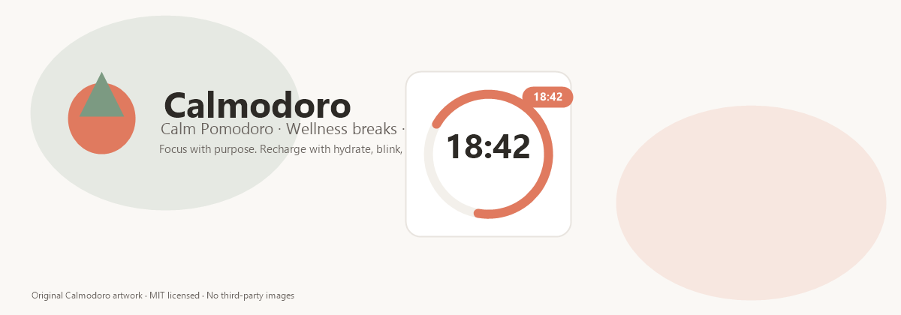
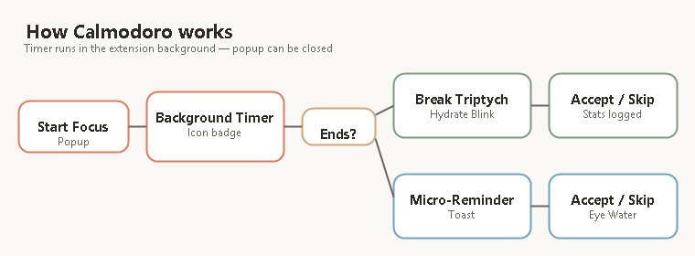

<p align="center">
  
</p>

<p align="center">
  <a href="LICENSE"></a>
  <a href="https://developer.chrome.com/docs/extensions/mv3/"></a>
  
  
  
  
</p>

# Calmodoro

**Calm Pomodoro timer for Chrome** — structured focus sessions, wellness break rituals (hydrate · blink · stretch), independent micro-reminders, and a **live countdown on the toolbar icon** while the timer runs in the background.

---

## Toolbar icon timer (badge)

When a focus or break session is **running**, Calmodoro shows the remaining time directly on the **extension icon** in Chrome’s toolbar:

| State | Badge example | Color |
|-------|---------------|-------|
| Focus running | `18:42` or `25m` | Coral |
| Break running | `04:32` | Sage |
| Paused | `⏸` | Gray |
| Idle | *(empty)* | — |

**How it works**

- Timer state lives in the **background service worker** (`chrome.storage` + `chrome.alarms`) — closing the popup does **not** stop the session.
- A dedicated **offscreen document** updates the badge **every second** while the timer runs.
- If offscreen is unavailable, a **30-second alarm fallback** still keeps the badge roughly current.
- Session end fires reliably via `chrome.alarms` at the stored `endTime`.

You can keep working in any tab and glance at the icon to see time left — no need to keep the popup open.

---

## Features

| Feature | Description |
|---------|-------------|
| **Pomodoro timer** | Focus, short break, long break — Start / Pause / Resume / Reset |
| **Live icon badge** | Second-by-second countdown on the toolbar icon |
| **Break triptych** | Three-panel ritual: hydrate, blink, stretch/walk (original CSS/SVG animations) |
| **Micro-reminders** | Independent eye, water, and stretch intervals during active hours |
| **Active schedule** | Work days, start/end times, lunch block |
| **Time-slot durations** | e.g. 50 min morning focus, 25 min afternoon |
| **Layout options** | Full, half (top/bottom/left/right), popup, compact toast |
| **Skip & miss tracking** | Stats for completed, skipped, and missed breaks |
| **Do Not Disturb** | Suppress overlays; timer and badge still run |
| **Offline recovery** | Ask / resume / reset after system sleep (configurable) |

---

## How it works

<p align="center">
  
</p>

---

## Getting started

### Install locally (Developer mode)

1. Clone the repository:
   ```bash
   git clone https://github.com/nuthanm/Calmodoro.git
   cd Calmodoro
   ```
2. Open Chrome → `chrome://extensions`
3. Enable **Developer mode**
4. Click **Load unpacked** → select the `Calmodoro` folder
5. Pin the Calmodoro icon to the toolbar

### Verify the icon timer

1. Click the Calmodoro icon → **Start Focus**
2. **Close the popup** and browse normally
3. Watch the **badge on the icon** count down each second
4. When the session ends, the break window opens (unless DND is on)

### Testing observations / known issues (living doc)

While testing, we log observations, issues, and the recommended fixes/verification steps in:

- [TESTING_OBSERVATIONS.md](./TESTING_OBSERVATIONS.md)

**Process rule**: Whenever you find a new issue or noteworthy behavior during testing, **append it to `TESTING_OBSERVATIONS.md`** (do not overwrite old entries).

### Project study guide (architecture & self-service fixes)

For full tech stack, data storage, persistence across restarts, flowcharts, and where to edit code without AI:

- [docs/CALMODORO_STUDY_GUIDE.md](./docs/CALMODORO_STUDY_GUIDE.md)

### Reload after code changes

- Click **Reload** on the extension card at `chrome://extensions`
- For service worker changes, use **Service worker → Inspect** to view logs

---

## Project structure

```
Calmodoro/
├── manifest.json           # MV3 manifest (v2.0.1)
├── background.js           # Service worker: timer, badge, alarms, reminders
├── offscreen.html/js       # 1-second toolbar badge updates
├── timerUtils.js           # Badge text formatting
├── settingsDefaults.js     # Shared settings schema
├── scheduleUtils.js        # Active hours & time slots
├── statsUtils.js           # Daily skip/miss/completion stats
├── popup.html/css/js       # Toolbar popup
├── break.html/css/js       # Break triptych overlay
├── toast.html/css/js       # Compact micro-reminder card
├── settings.html/css/js    # Full settings page
├── stats.html/css/js       # Progress & activity log
├── recovery.html           # Missed-break prompt after offline
├── design-tokens.css       # Soft light design system
├── animations.css          # Original character motion
├── characters.js           # Original SVG character art
├── docs/
│   ├── hero.png            # README hero banner (PNG — displays on GitHub)
│   ├── hero.svg            # Vector source for hero
│   └── flow-diagram.png    # README flow diagram (PNG)
├── ChromeWebStore/         # Store listing kit (screenshots, descriptions, checklist)
├── icons/                  # Extension icons (PNG)
├── ATTRIBUTIONS.md         # License & attribution registry
└── prototype/              # Design preview (not shipped)
```

---

## Intellectual property & compliance

Calmodoro is designed to avoid copyright strikes and licensing surprises:

| Policy | Status |
|--------|--------|
| Original break character animations | Yes — `characters.js`, `animations.css` |
| Original icons & hero banner | Yes — `icons/`, `docs/hero.png` |
| Stock photos / commercial illustration packs | **Not used** |
| Remote code execution | **None** |
| Analytics / tracking SDKs | **None** |
| Third-party fonts | DM Sans via Google Fonts (SIL OFL 1.1) |
| Optional legacy library | lottie-web (MIT) — see [ATTRIBUTIONS.md](./ATTRIBUTIONS.md) |

**Before adding any external asset**, read the maintainer checklist in [ATTRIBUTIONS.md](./ATTRIBUTIONS.md).

---

## Licenses & attributions

| Document | Purpose |
|----------|---------|
| [LICENSE](./LICENSE) | MIT License for project source code |
| [ATTRIBUTIONS.md](./ATTRIBUTIONS.md) | Structured registry of all third-party and original assets |

**Summary:** Project code is **MIT**. Original artwork is **MIT**. DM Sans is **SIL OFL 1.1**. lottie-web is **MIT** (optional). No asset requires a paid license or prohibits commercial use in the default configuration.

---

## Settings overview

Open **Settings** from the gear icon in the popup:

- **Active hours** — days, start/end, lunch block
- **Durations** — focus, breaks, sessions before long break, morning/afternoon slots
- **Micro-reminders** — blink, water, stretch intervals
- **Presentation** — break layout, toast vs notification
- **After sleep** — ask (default), resume, or reset

---

## Package for Chrome Web Store

```bash
# From repository root (exclude docs/prototype if desired)
zip -r calmodoro.zip . \
  --exclude "*.git*" \
  --exclude "prototype/*" \
  --exclude ".gitignore"
```

Upload `calmodoro.zip` to the [Chrome Web Store Developer Dashboard](https://chrome.google.com/webstore/devconsole/).

**Full publishing kit** (screenshots, descriptions, checklist, privacy policy): see [ChromeWebStore/README.md](./ChromeWebStore/README.md).

Include [ATTRIBUTIONS.md](./ATTRIBUTIONS.md) in your store listing or privacy notes if reviewers ask about asset provenance.

---

## Contributing

1. Fork the repository
2. Create a feature branch
3. Keep changes focused and test in Chrome (unpacked)
4. **Do not add copyrighted assets** without documenting them in ATTRIBUTIONS.md
5. Open a pull request with a clear summary

---

## About

Calmodoro helps you stay productive with structured focus and gentle wellness rituals — without noisy notifications or licensing risk.

For questions or ideas, open an issue in this repository.
