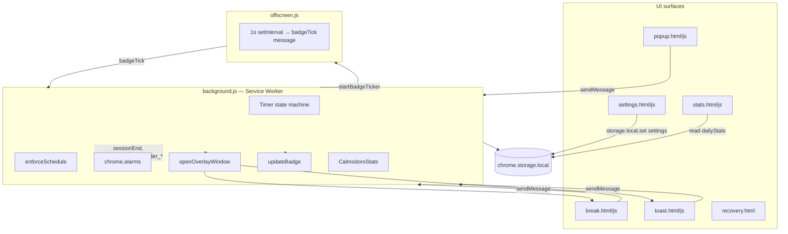
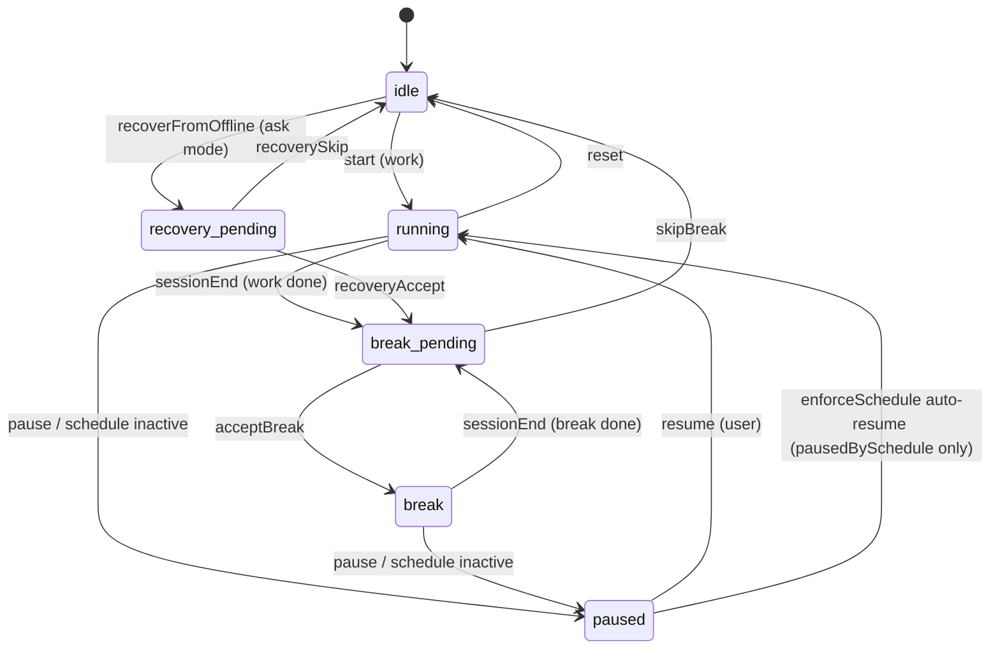
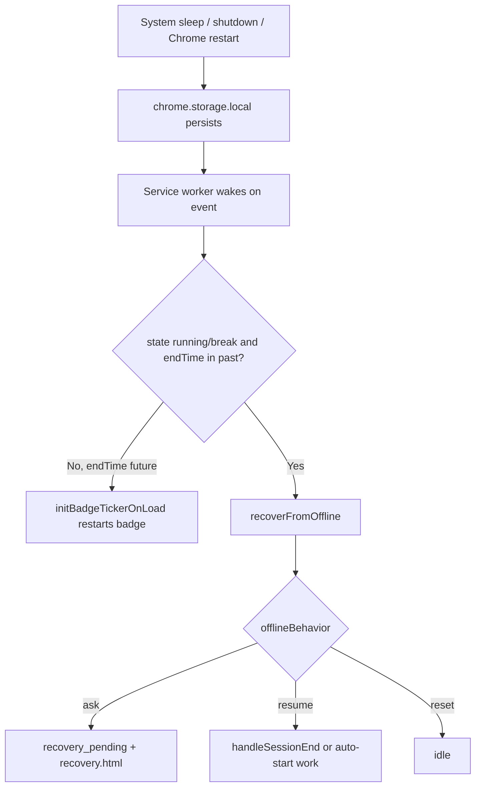
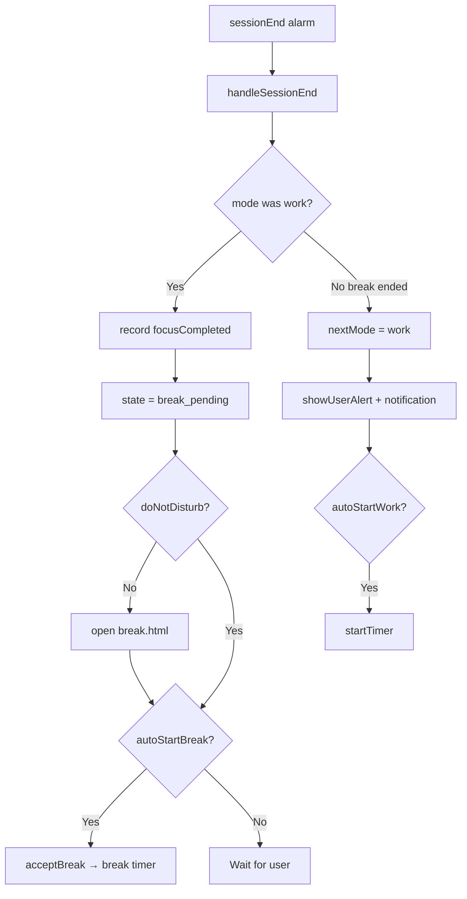

# Calmodoro — Project Study Guide

**Purpose:** A self-contained reference so you can understand, debug, enhance, and fix Calmodoro **without AI tools**. Includes architecture, tech stack, data storage, persistence, and flowcharts.

**Version covered:** Manifest **2.0.2** (see `manifest.json`)

**Related docs:**
- [README.md](../README.md) — quick start
- [TESTING_OBSERVATIONS.md](../TESTING_OBSERVATIONS.md) — living test log
- [ChromeWebStore/privacy/privacy-policy.md](../ChromeWebStore/privacy/privacy-policy.md) — privacy summary

---

## 1. What Calmodoro is

Calmodoro is a **Chrome Extension (Manifest V3)** that implements a Pomodoro-style focus timer with:

- Focus / short break / long break cycles
- Wellness break UI (hydrate, blink, stretch)
- Independent micro-reminders (eyes, water, stretch)
- Work schedule (days, hours, lunch block)
- Live countdown on the **toolbar icon badge**
- Local-only stats (no servers, no analytics)

All logic runs in the browser. There is **no backend**.

---

## 2. Tech stack (complete list)

| Layer | Technology | Notes |
|-------|------------|-------|
| **Platform** | Chrome Extension **Manifest V3** | Service worker background, no persistent background page |
| **Languages** | HTML, CSS, JavaScript (ES modules pattern via IIFEs) | No TypeScript, no bundler |
| **Background** | Service worker (`background.js`) | Timer, alarms, schedule, windows, notifications |
| **UI pages** | `popup.html`, `break.html`, `toast.html`, `settings.html`, `stats.html`, `recovery.html` | Each has matching `.css` / `.js` |
| **Offscreen doc** | `offscreen.html` + `offscreen.js` | 1-second badge tick loop (MV3 offscreen API) |
| **Chrome APIs** | `storage`, `alarms`, `notifications`, `windows`, `offscreen`, `action` (toolbar) | Declared in `manifest.json` |
| **Shared modules** | `settingsDefaults.js`, `scheduleUtils.js`, `timerUtils.js`, `statsUtils.js` | Loaded via `importScripts` in SW or `<script>` in pages |
| **Styling** | `design-tokens.css`, `animations.css`, per-page CSS | CSS variables for theme |
| **Graphics** | `characters.js` (inline SVG), `icons/*.png` | Original art; optional `lottie/` (not required at runtime) |
| **Fonts** | DM Sans via Google Fonts | Loaded from settings/stats pages only |
| **Build tools** | **None** for the extension itself | Load unpacked folder directly |
| **Store kit** | Node scripts under `ChromeWebStore/capture/` | Screenshot generation only; not shipped |

**What is NOT used:** React, Vue, webpack, npm runtime deps, databases, cloud sync, analytics SDKs, remote code.

---

## 3. High-level architecture



**Rule of thumb:** The **service worker owns truth**. UI pages read/write via messages or storage; they do not run the timer themselves.

---

## 4. File map (what to edit for what)

| Goal | Primary files |
|------|----------------|
| Timer start/pause/resume/end | `background.js` |
| Schedule / lunch / active hours | `scheduleUtils.js`, `settingsDefaults.js` |
| Popup UI & button states | `popup.html`, `popup.js`, `popup.css` |
| Toolbar badge format | `timerUtils.js`, `background.js` (`updateBadge`) |
| 1s badge updates | `offscreen.js`, `background.js` (`startBadgeTicker`) |
| Break triptych | `break.html`, `break.js`, `break.css`, `characters.js` |
| Micro-reminders | `background.js` (`rescheduleMicroReminders`, `fireMicroReminder`) |
| Schedule pause toasts | `background.js` (`enforceSchedule`, `showScheduleAlert`), `toast.js` |
| Settings form | `settings.html`, `settings.js` |
| Daily stats | `statsUtils.js`, `stats.html`, `stats.js` |
| After sleep / offline | `background.js` (`recoverFromOffline`), `recovery.html` |
| Permissions | `manifest.json` |
| Default values | `settingsDefaults.js` |

---

## 5. Timer state machine



### State values in `chrome.storage.local`

| `state` | Meaning |
|---------|---------|
| `idle` | No active countdown |
| `running` | Focus session counting down (`endTime` set) |
| `break` | Break session counting down |
| `paused` | Frozen; `remainingMs` holds time left |
| `break_pending` | Work finished; waiting for user to start/skip break |
| `recovery_pending` | Session missed during sleep; user must choose |

### Mode values (`mode`)

`work` | `shortBreak` | `longBreak`

---

## 6. Message API (popup ↔ service worker)

All messages use `chrome.runtime.sendMessage({ action: '...' })`.

| `action` | Handler | Returns |
|----------|---------|---------|
| `start` | `startTimer()` | Timer state; may include `scheduleBlocked: true` |
| `pause` | `pauseTimer()` | Timer state |
| `resume` | `resumeTimer()` | Timer state |
| `reset` | `resetTimer()` | Timer state |
| `setMode` | `setMode(mode)` | Timer state |
| `getState` | `enforceSchedule()` + `getTimerState()` | Full state object |
| `badgeTick` | `enforceSchedule()` + `updateBadge()` | `{ ok: true }` |
| `getStats` | `CalmodoroStats.getSummary()` | Daily stats |
| `startBreak` | `startBreakTimer()` | Timer state |
| `skipBreak` | `skipBreak()` | Timer state |
| `acceptBreak` | `acceptBreak()` | Timer state |
| `acceptReminder` | `acceptReminder(kind)` | Timer state |
| `skipReminder` | `skipReminder(kind)` | Timer state |
| `recoveryAccept` | `recoveryAccept()` | Timer state |
| `recoverySkip` | `recoverySkip()` | Timer state |
| `settingsUpdated` | `onSettingsUpdated()` | Timer state |

**Offscreen → background:** `startBadgeTicker`, `stopBadgeTicker` (handled in `offscreen.js` listener, not `handleMessage` switch — see `offscreen.js`).

---

## 7. Alarms

| Alarm name | When created | Purpose |
|------------|--------------|---------|
| `sessionEnd` | Start focus/break | Fires at `endTime` → `handleSessionEnd()` |
| `badgeTick` | While timer runs | Fallback badge update (~every 0.1 min if offscreen fails) |
| `scheduleCheck` | On SW load | Every **1 minute**: reminders + schedule + auto-start |
| `scheduleResume` | Schedule pauses timer | One-shot at `resumeAtMs` to auto-resume |
| `reminder_blink` | Active schedule | Periodic micro-reminder |
| `reminder_water` | Active schedule | Periodic micro-reminder |
| `reminder_stretch` | Active schedule | Periodic micro-reminder |

```mermaid
sequenceDiagram
  participant User
  participant Popup
  participant SW as background.js
  participant Alarm as chrome.alarms
  participant Off as offscreen.js

  User->>Popup: Start Focus
  Popup->>SW: start
  SW->>SW: storage: state=running, endTime=...
  SW->>Alarm: create sessionEnd
  SW->>Off: createDocument + startBadgeTicker
  loop Every 1s
    Off->>SW: badgeTick
    SW->>SW: enforceSchedule + updateBadge
  end
  Alarm->>SW: sessionEnd
  SW->>SW: handleSessionEnd → break_pending
  SW->>User: open break.html (if not DND)
```

---

## 8. Data storage

### 8.1 Where data lives

Everything uses **`chrome.storage.local`** only (not `sync`, not `session`).

- Stored on disk by Chrome in the user profile
- **Not** sent to any Calmodoro server
- Survives: closing popup, closing browser tabs, **browser restart**, **system reboot**
- Lost when: uninstall extension, user clears extension data, profile corruption, or explicit `chrome.storage.local.clear()`

### 8.2 Storage keys reference

| Key | Type | Written by | Purpose |
|-----|------|------------|---------|
| `settings` | Object | `settings.js`, `popup.js` (DND) | All user preferences (merged with defaults) |
| `state` | String | `background.js` | Timer state machine value |
| `mode` | String | `background.js` | `work` / `shortBreak` / `longBreak` |
| `endTime` | Number (ms epoch) | `background.js` | When running/break ends |
| `remainingMs` | Number | `background.js` | Frozen time when paused |
| `pausedBySchedule` | Boolean | `background.js` | `true` if schedule paused the timer |
| `scheduleActiveLast` | Boolean | `background.js` | Previous schedule active flag (transitions) |
| `sessionCount` | Number | `background.js` | Completed focus sessions (for long break cadence) |
| `recoveryMode` | String | `background.js` | Mode to offer after offline recovery |
| `dailyStats` | Object | `statsUtils.js` | Map of `YYYY-MM-DD` → day stats |

### 8.3 `settings` object shape (defaults in `settingsDefaults.js`)

```
workDuration, shortBreakDuration, longBreakDuration, sessionsBeforeLongBreak
autoStartBreak, autoStartWork, doNotDisturb
breakWindowMode, reminderWindowMode, soundEnabled, offlineBehavior
schedule: { activeDays, startTime, endTime, lunchStart, lunchEnd }
durationSlots: [{ start, end, workDuration }, ...]
microReminders: { blink, water, stretch: { enabled, intervalMin } }
```

`mergeSettings()` always rebuilds `durationSlots` from schedule + saved slot durations.

### 8.4 `dailyStats` structure

```javascript
dailyStats = {
  "2026-07-02": {
    focusCompleted: 0,
    breaksAccepted: 0,
    breaksSkipped: 0,
    breaksMissed: 0,
    reminderBlink: 0,
    reminderWater: 0,
    reminderStretch: 0,
    remindersSkipped: 0,
    log: [ { type, detail, time }, ... ]  // max 50 entries per day
  }
}
```

### 8.5 How long is data kept?

| Data | Retention policy in code |
|------|--------------------------|
| Settings | **Indefinite** until user resets or uninstalls |
| Timer state (`state`, `endTime`, etc.) | **Indefinite** while extension installed; updated continuously |
| `dailyStats` per day | **Indefinite** — no automatic purge of old dates |
| Activity `log` per day | **Last 50 events** per day only (`statsUtils.js` truncates) |

There is **no** TTL, expiry job, or cloud backup. Old `dailyStats` keys accumulate forever (small JSON blobs).

### 8.6 Restart / shutdown — what happens?



| Scenario | Data lost? | Timer behavior |
|----------|------------|----------------|
| Close popup | No | Keeps running (alarms + offscreen) |
| Close all Chrome windows | No | Alarms can wake SW; state on disk |
| System sleep past `endTime` | No | `recoverFromOffline()` on next SW start |
| Browser crash | Usually no | Same as sleep if storage flushed |
| Reload extension | No* | SW restarts; `recoverFromOffline` runs |
| Uninstall extension | **Yes — all data** | — |
| Clear site data for extension | **Yes** | — |

\*Reload may briefly interrupt offscreen doc; badge ticker re-inits if session still valid.

**Paused sessions** (`remainingMs`): Survive restart. User or schedule must resume.

**Schedule-paused** (`pausedBySchedule: true`): Survives restart; `scheduleCheck` / `scheduleResume` alarms enforce resume.

---

## 9. Schedule system

`CalmodoroSchedule` (`scheduleUtils.js`) answers:

- `isScheduleActive(settings)` — boolean
- `getScheduleStatus(settings)` — `{ active, reason, message, resumeAtMs, activeHoursLabel }`

Inactive reasons: `inactive_day`, `before_start`, `after_end`, `lunch`.

`enforceSchedule()` in `background.js`:

1. If schedule **active** and was schedule-paused → auto-resume + welcome toast
2. If schedule **inactive** and timer running → pause with `pausedBySchedule: true` + toast + `scheduleResume` alarm

---

## 10. Window / overlay modes

`openOverlayWindow(mode, page)` in `background.js`:

| `mode` | Behavior |
|--------|----------|
| `popup` | Centered 520×640 |
| `fullWindow` | Maximized popup |
| `toast` | Bottom-right 340×160 |
| `alert` | Centered 420×220 |
| `sideLeft` / `sideRight` | Half width |
| `sideTop` / `sideBottom` | Half height |

`breakWindowMode` and `reminderWindowMode` in settings map to these (with `halfRight` → `sideRight`).

Fallback: system notification if window create fails.

---

## 11. Debugging without AI

### 11.1 Setup

1. `chrome://extensions` → Developer mode → **Load unpacked** → repo folder
2. **Reload** after every code change
3. Click **Service worker** → **Inspect** for `background.js` logs
4. Popup: right-click extension icon → **Inspect popup**

### 11.2 Inspect storage

Service worker console:

```javascript
chrome.storage.local.get(null, console.log)
```

Clear everything (destructive):

```javascript
chrome.storage.local.clear()
```

### 11.3 Common issues → where to look

| Symptom | Check |
|---------|-------|
| Badge not updating | `offscreen.js`, SW console for offscreen errors, `badgeTick` handler |
| Timer stops when popup closes | `endTime` in storage, `sessionEnd` alarm, SW not killed permanently |
| Schedule didn't pause | `enforceSchedule`, `scheduleCheck` alarm, `getScheduleStatus` |
| Auto-resume when shouldn't | `pausedBySchedule` flag — manual pause must be `false` |
| Break window wrong position | `openOverlayWindow`, `getWindowAnchor` |
| Stats wrong | `statsUtils.js` `record()` call sites in `background.js` |
| Settings not applying | `settings.js` save → `settingsUpdated` message |

### 11.4 Safe change patterns

1. **New setting:** Add default in `settingsDefaults.js` → form in `settings.html/js` → read in `background.js` via `getSettings()`
2. **New UI action:** Add `case` in `handleMessage` → wire button in `popup.js`
3. **New alarm:** Unique name string → create in one place → handle in `chrome.alarms.onAlarm`
4. **New stat:** Add key in `statsUtils.js` `STAT_KEYS` → `record()` from event handler

---

## 12. Session end flow (focus → break)



---

## 13. Permissions (why each exists)

| Permission | Use |
|------------|-----|
| `storage` | Settings, timer state, stats |
| `alarms` | Session end, schedule, reminders, badge fallback |
| `notifications` | Fallback when overlay windows fail; session alerts |
| `windows` | Break, toast, recovery popups |
| `offscreen` | 1-second badge ticker document |

No `tabs`, `host_permissions`, or network permission in manifest.

---

## 14. Packaging & version

- Bump `"version"` in `manifest.json` for releases
- Zip repo (exclude `.git`, `prototype/` if desired) for Chrome Web Store
- See [ChromeWebStore/README.md](../ChromeWebStore/README.md)

---

## 15. Enhancement ideas (implementation hints)

| Idea | Approach |
|------|----------|
| Purge stats older than N days | Loop `dailyStats` keys in a new SW startup helper |
| Export stats CSV | Read `dailyStats` in `stats.js`, build CSV, download blob |
| Compact badge for 10+ min | Restore threshold in `timerUtils.formatBadgeCountdown` |
| Fix duplicate notification+window | `fireMicroReminder`: branch on `notification` mode only |
| Sync settings across machines | Would need `chrome.storage.sync` + size limits (not implemented) |
| Sound on session end | Use offscreen doc or `chrome.notifications` with sound; respect `soundEnabled` |

---

## 16. Glossary

| Term | Meaning |
|------|---------|
| **SW** | Service worker (`background.js`) |
| **DND** | Do Not Disturb — suppresses overlays, not timer |
| **MV3** | Manifest V3 extension platform |
| **Badge** | Text on extension toolbar icon |
| **Offscreen document** | Hidden page allowed to run timers in MV3 |

---

*Last updated: July 2026 — align with branch containing schedule enforcement, `pausedBySchedule`, and offscreen `badgeTick` delegation.*
